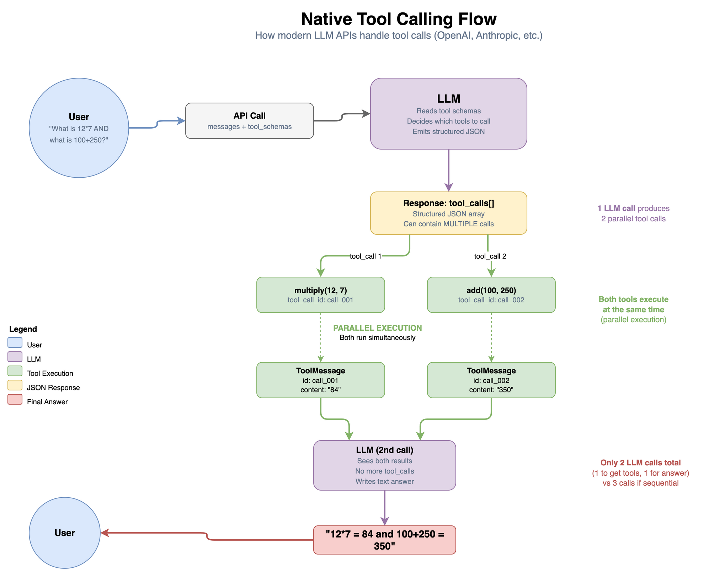
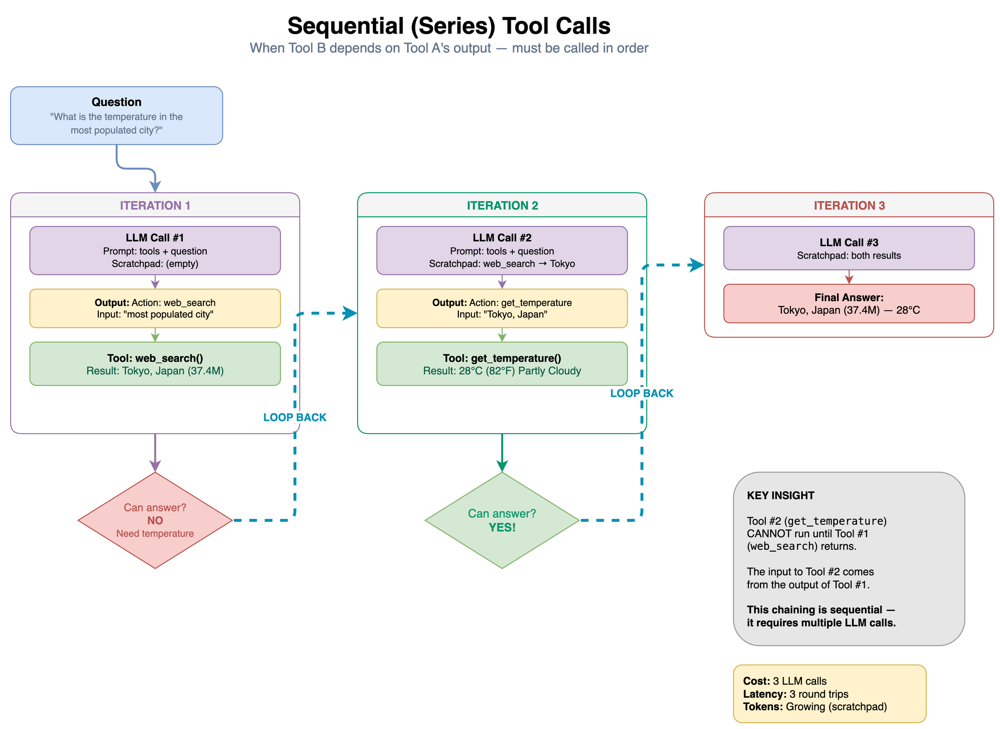
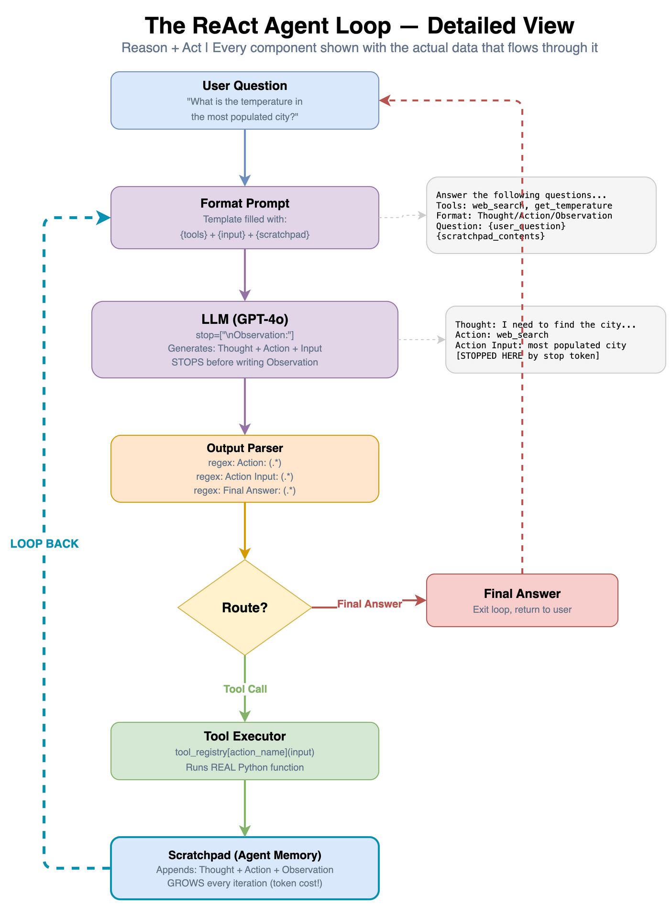

# ReAct and Tool-Calling Agents from Scratch

A hands-on curriculum that teaches how LLM agents actually work under the hood. No magic, no hand-waving. You start with a single API call and build up to a full ReAct agent, then compare it against modern native tool calling with real token-cost measurements.

Everything is built from first principles using Python, OpenAI, and LangChain.

## What You Will Learn

By the end of this curriculum you will understand:

- What happens when an LLM "calls a tool" (it is just JSON in, JSON out)
- How to build a complete ReAct agent in ~50 lines of Python with no framework
- Why every component of the agent loop exists (by breaking each one and watching it fail)
- How ReAct compares to native tool calling in tokens, latency, and robustness
- How to build standalone agents for real tasks (web search, natural language to SQL)

## Repository Structure

```
.
├── notebooks/                          # Jupyter notebook curriculum (start here)
│   ├── 00_tool_calling_live_demo.ipynb # Live class walkthrough: tool calling with weather API
│   ├── 01_tool_calling.ipynb           # Tool calling end to end, demystified
│   ├── 02_react_from_zero.ipynb        # Build a ReAct agent from scratch (~50 lines)
│   ├── 03_react_failure_modes.ipynb    # Break every component, learn why each exists
│   ├── 04_react_loop.ipynb             # ReAct with LangChain's original prompt
│   ├── 05_react_visualized.ipynb       # Token costs and prompt growth at every step
│   └── 06_react_vs_native_side_by_side.ipynb  # Head-to-head comparison with real numbers
│
├── agents/                             # Standalone agent scripts
│   ├── agent_react_demo.py             # Full ReAct agent with rich terminal output
│   └── agent_nl_sql_demo.py            # Natural language to SQL agent
│
├── diagrams/                           # Architecture and flow diagrams
│   ├── native_tool_calling_flow.png    # How native tool calling works (parallel calls)
│   ├── sequential_tool_calls.png       # Sequential chaining across iterations
│   ├── react_agent_loop.png            # The full ReAct loop, detailed view
│   └── agent_diagrams.drawio           # Editable source (draw.io)
│
├── react_loop_visualizer.html          # Interactive browser visualization of the ReAct loop
├── demo_company.db                     # Sample SQLite database for the NL-to-SQL agent
├── .env.example                        # Template for your API keys
├── pyproject.toml                      # Python dependencies (managed with uv)
└── README.md
```

## Prerequisites

- Python 3.11+
- An OpenAI API key

Optional keys for extended demos:
- [Tavily](https://tavily.com) API key (free tier) for web search tool
- [WeatherAPI](https://www.weatherapi.com) key (free tier) for the live demo notebook

## Quick Start

**1. Clone the repo**

```bash
git clone https://github.com/fnusatvik07/react-tool-agent.git
cd react-tool-agent
```

**2. Set up your environment**

Using [uv](https://docs.astral.sh/uv/) (recommended):

```bash
uv sync
```

Or with pip:

```bash
python -m venv .venv
source .venv/bin/activate
pip install -e .
```

**3. Configure API keys**

```bash
cp .env.example .env
```

Open `.env` and paste your API keys.

**4. Run the notebooks**

```bash
jupyter notebook notebooks/
```

Start with `00_tool_calling_live_demo.ipynb` for the class walkthrough, then follow the numbered sequence `01` through `06`.

**5. Run the standalone agents**

```bash
python agents/agent_react_demo.py
python agents/agent_react_demo.py --verbose    # shows full prompt sent to the LLM

python agents/agent_nl_sql_demo.py
python agents/agent_nl_sql_demo.py --verbose
```

**6. Open the ReAct loop animation**

```bash
open react_loop_visualizer.html        # macOS
xdg-open react_loop_visualizer.html    # Linux
start react_loop_visualizer.html       # Windows
```

This opens an interactive browser animation that walks through each phase of the ReAct loop (Analyze, Plan, Reason, Act, Observe, Decide) step by step with live visuals.

## Notebook Curriculum

| # | Notebook | What You Learn |
|---|----------|----------------|
| 00 | Live Demo | Class walkthrough: tool binding, calling a weather API, formatting results |
| 01 | Tool Calling | What `tool_calls` and `ToolMessage` are. Parallel tool calls. Why descriptions matter |
| 02 | ReAct from Zero | Build a complete agent with just `openai`, regex, and a for loop. ~50 lines total |
| 03 | Failure Modes | Remove the stop token, swap descriptions, skip reasoning, inject prompts, remove limits |
| 04 | ReAct Loop | The original `hwchase17/react` prompt from LangChain Hub, run by hand |
| 05 | Visualized | See the full prompt at every iteration. Token cost tables. Prompt growth analysis |
| 06 | Side by Side | Same questions through ReAct vs native tool calling. Tokens, latency, parallel calls |

## Standalone Agents

### ReAct Agent (`agents/agent_react_demo.py`)

A complete ReAct agent built from scratch with LangChain. Includes tools for math, web search (Tavily), and weather lookup. Uses rich terminal output to show every step of the Reason-Act-Observe loop in real time.

### NL-to-SQL Agent (`agents/agent_nl_sql_demo.py`)

Converts natural language questions into SQL queries, executes them against a sample company database, and returns human-readable answers. Demonstrates the same ReAct pattern applied to a database use case with tools for listing tables, describing schemas, running queries, and validating SQL.

## Architecture Diagrams

The `diagrams/` folder contains visual explanations of the core concepts:

**Native Tool Calling Flow** shows how modern LLM APIs handle tool calls with structured JSON and parallel execution.



**Sequential Tool Calls** shows what happens when Tool B depends on Tool A's output and calls must be chained across iterations.



**The ReAct Agent Loop** shows the detailed view of the Reason + Act loop with the actual data flowing through each component.



## Key Takeaway

An agent is three things:

1. A prompt (or model) that tells the LLM how to format tool requests
2. A loop that parses the output, runs the tool, feeds the result back
3. An exit condition (no more tool calls, or "Final Answer")

Everything else, LangGraph, CrewAI, AutoGen, OpenAI Swarm, is convenience on top of these three pieces. This repo shows you what is underneath.

## License

MIT
