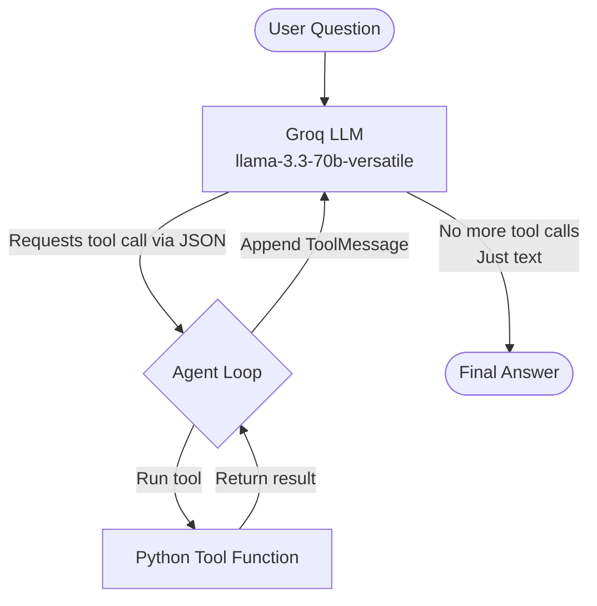
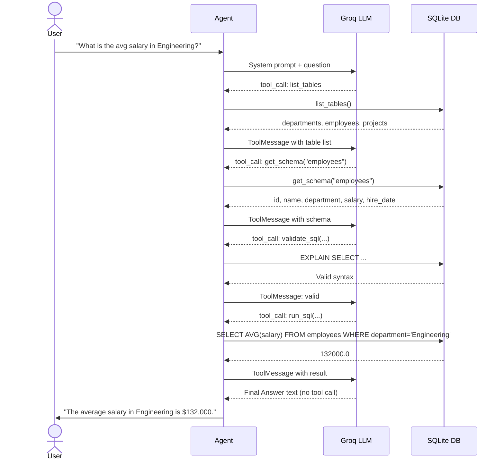

# DataInsight AI — Natural Language to SQL Agent

Ask questions in plain English, get answers from your database. Both agents in this project run on **Groq** (free tier) using `llama-3.3-70b-versatile`.

**Repository:** https://github.com/Srikanth-15L/NaturalLanguageToSQL.git

---

## How I Built This

Traditional text-based agent loops work by making the LLM output a formatted string like:

```
Thought: I need to check which tables exist first.
Action: list_tables
Action Input: all
```

...then using **regex** to parse that text and figure out which tool to run. It works, but it is fragile — any small formatting mistake from the model breaks the parser.

I built this project using **native Tool-Calling** (also called Function Calling), which is a better approach:

1. Python tool functions are defined with `@tool` decorators.
2. The LLM model is given the tool signatures via `llm.bind_tools(tools)`.
3. When the model wants to call a tool, instead of writing text, it returns a **structured JSON object** directly — like `{"name": "list_tables", "args": {}}`.
4. The agent loop reads that JSON, calls the right Python function, appends the result back to the conversation as a `ToolMessage`, and keeps going.
5. When the model stops requesting tools and just writes text, that is the **Final Answer**.

This makes the loop much more reliable because there is nothing to parse — the model and the tools speak the same structured language.

### Agent Flow



### SQL Agent Specific Flow

The SQL agent enforces a strict sequence of tool calls to avoid hallucinating column names or running invalid queries:



---

## Setup

### 1. Clone the repo

```bash
git clone https://github.com/Srikanth-15L/NaturalLanguageToSQL.git
cd NaturalLanguageToSQL
```

### 2. Set up API keys

```bash
cp .env.example .env
```

Open `.env` and add your Groq key (get one free at https://console.groq.com):

```
GROQ_API_KEY=gsk_...

# Optional -- enables real web search (free tier at tavily.com)
TAVILY_API_KEY=tvly-...

# Optional -- enables real weather data (free tier at weatherapi.com)
WEATHER_API_KEY=...
```

### 3. Install Python dependencies

```bash
uv sync
```

---

## How to Run

### Web App (React frontend + FastAPI backend)

Start the backend:

```bash
uv run uvicorn api:app --host 127.0.0.1 --port 8000
```

Start the frontend in a second terminal:

```bash
cd frontend
npm install
npm run dev
```

Open **http://localhost:5173** in your browser.

---

### CLI Agents (terminal-only)

Run the SQL database agent:

```bash
uv run python core/sql_agent.py
uv run python core/sql_agent.py --verbose
```

Run the general search + calculator agent:

```bash
uv run python core/search_agent.py
uv run python core/search_agent.py --verbose
```

The `--verbose` flag prints the full message history sent to the LLM on every iteration so you can see exactly what context the model sees.
