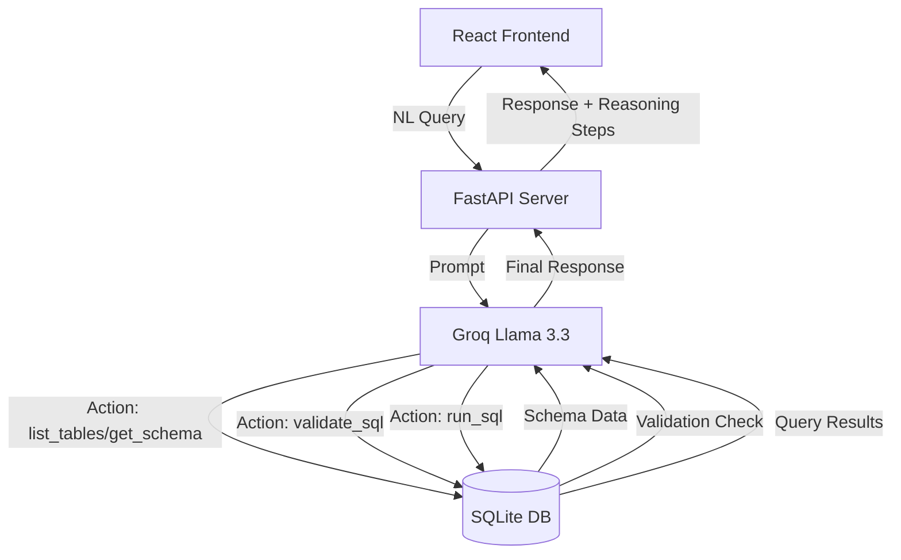
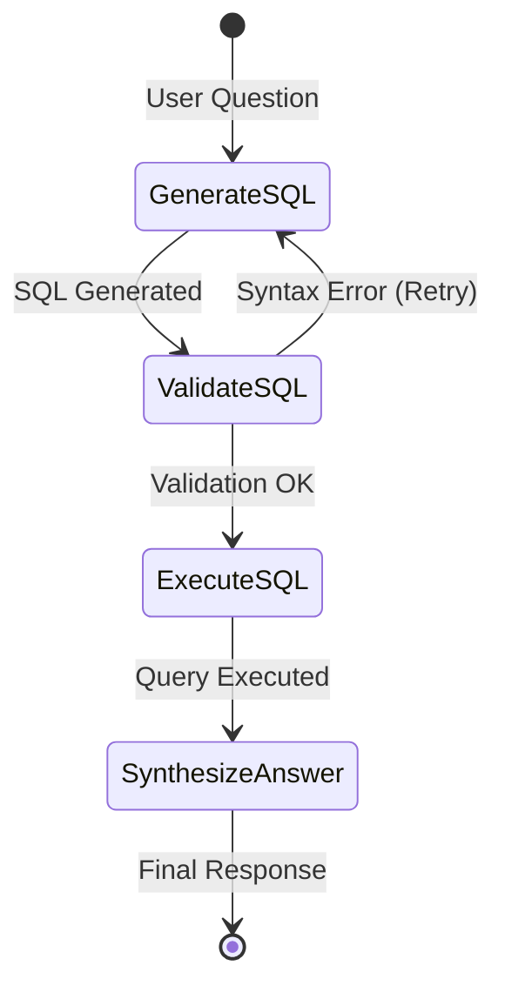

# DataInsight AI — Natural Language to SQL Agent

Ask questions in plain English, get answers from your database. Powered by a custom ReAct agent loop built with LangChain and Groq.

**Repository:** https://github.com/Srikanth-15L/NaturalLanguageToSQL.git

---

## How to Run

### 1. Clone the repo

```bash
git clone https://github.com/Srikanth-15L/NaturalLanguageToSQL.git
cd NaturalLanguageToSQL
```

### 2. Set up API keys

```bash
cp .env.example .env
```

Open `.env` and add your keys:

```
GROQ_API_KEY=gsk_...
```

### 3. Start the backend

```bash
uv sync
uv run uvicorn api:app --host 127.0.0.1 --port 8000
```

### 4. Start the frontend

```bash
cd frontend
npm install
npm run dev
```

Open **http://localhost:5173** in your browser.

---

## Run the CLI agents directly

```bash
# SQL agent (natural language to SQL)
uv run python core/sql_agent.py
uv run python core/sql_agent.py --verbose

# Search agent (web search, weather, calculator)
uv run python core/search_agent.py
uv run python core/search_agent.py --verbose
```

---

## System Design & Architecture

The application operates as a **ReAct (Reason + Act)** loop that iteratively queries, validates, and runs SQL statements on a local database.



---

## Alternative System Architectures (To Get the Same Output)

If you want to implement the exact same behavior (translating NL &rarr; SQL &rarr; Validate &rarr; Execute) using different software designs, you can use these architectures:

### 1. LangGraph State Graph (Recommended for Production)
Instead of a linear text parsing loop, you build the workflow as a finite state machine (state graph). This makes retrying validation errors highly structured.



### 2. Native LLM Function Calling (JSON-based)
Instead of parsing Thought/Action patterns using regex, the LLM outputs structured JSON matching your python tools natively.

```python
# Bind tools directly to the model
llm_with_tools = ChatGroq(model="llama-3.3-70b-versatile").bind_tools(tools)

# Invoke
response = llm_with_tools.invoke("What is the average employee salary?")
if response.tool_calls:
    for call in response.tool_calls:
        # Run tool directly using call['name'] and call['args']
        pass
```

### 3. Built-in LangChain SQL Agent (`create_sql_agent`)
Leverage pre-built library kits for zero-config database agents.

```python
from langchain_community.utilities import SQLDatabase
from langchain_community.agent_toolkits import create_sql_agent

db = SQLDatabase.from_uri("sqlite:///demo_company.db")
agent = create_sql_agent(llm=ChatGroq(model="llama-3.3-70b-versatile"), db=db, verbose=True)
response = agent.invoke({"input": "Show me Engineering projects"})
```
