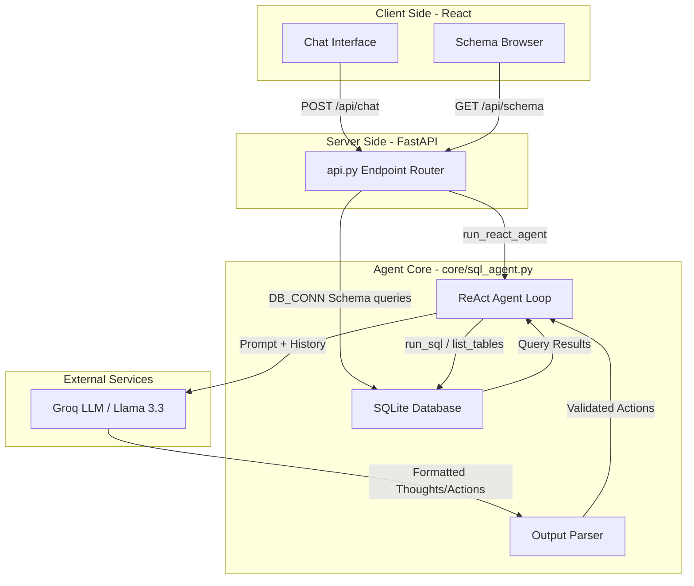
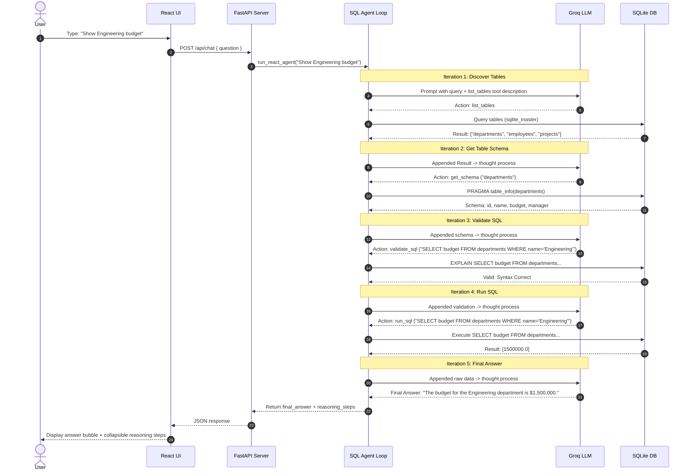
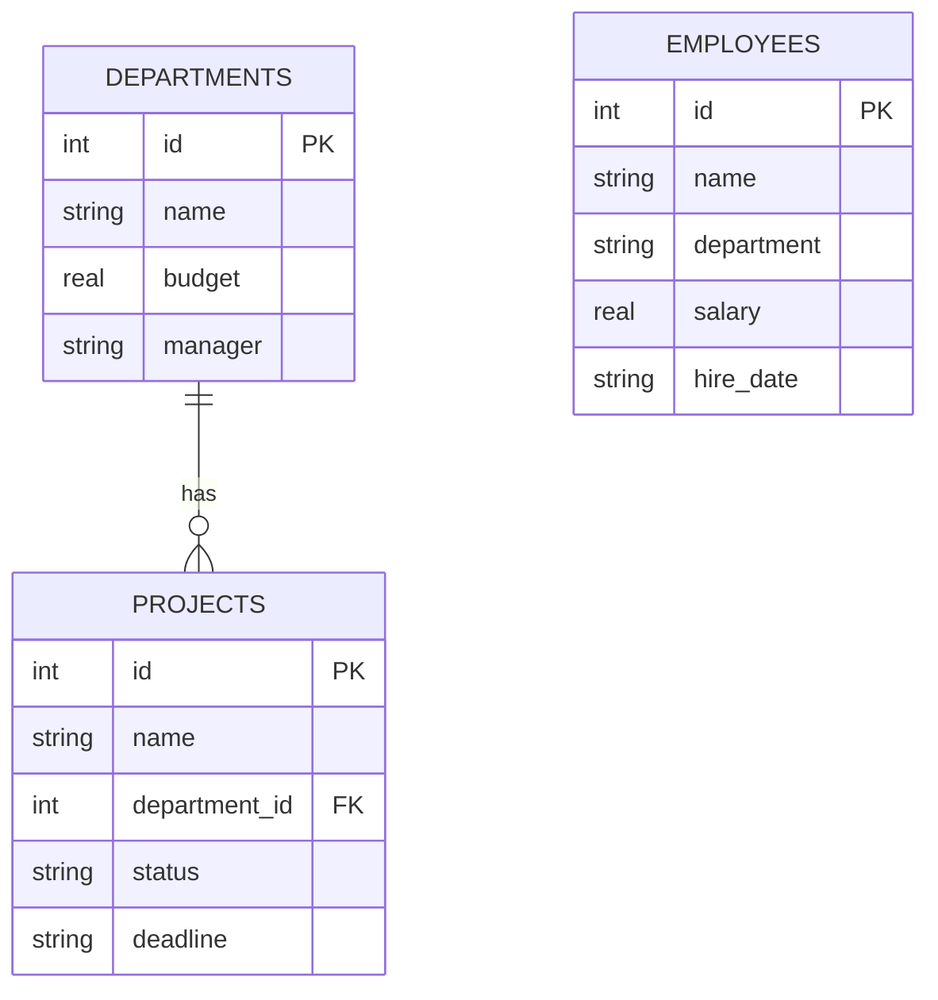

# System Design: DataInsight AI (Natural Language to SQL)

This document describes the architecture, data flow, and components of the Natural Language to SQL interface. It uses **Mermaid.js** diagrams, which are natively rendered by GitHub and modern markdown viewers.

---

## 1. High-Level Architecture

The system consists of three main tiers:
1. **Frontend (Vite + React)**: Providing the user interface, schema browser, and reasoning visualizer.
2. **Backend (FastAPI)**: Serving API endpoints for database schema inspection and routing chat requests to the agent core.
3. **Core (ReAct Agent + SQLite)**: Running the Reason-Act-Observe loop, interacting with the LLM (Groq Llama 3.3), and executing queries on the SQLite database.

---

## 2. ReAct Loop Request Lifecycle (Sequence Diagram)

This sequence diagram illustrates the exact sequence of actions when a user asks: *"What is the budget of the Engineering department?"*

---

## 3. Database Schema Design

The SQLite database (`demo_company.db`) has three main relational tables:

